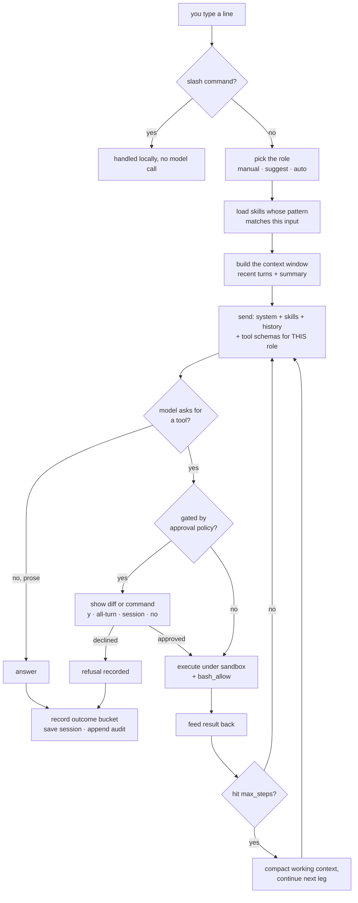
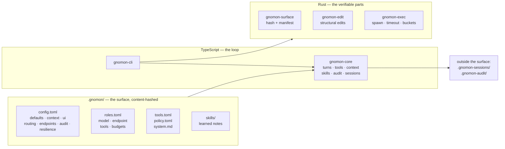

# Gnomon Harness 

**A coding agent whose behaviour is fixed by files in your repository, not by
your machine.**

Point it at a project, and everything that decides how it acts — which models,
which roles, which tools each role may touch, when it must ask permission —
lives in one directory called `.gnomon/`. That directory is hashed. Clone the
repo on another machine and you get the same agent.

```bash
cd my-project && gnomon launch
```

<p align="center">
  
</p>

### Why "gnomon"

The **gnomon** is the blade on a sundial — the part that casts the shadow.

It is also the only part that does not move. The sun travels, the shadow
sweeps the hours, but the blade is fixed, and that is precisely why the dial
can be read at all. Take the gnomon away and you have a decorated stone.

That is the whole design in one object. The model varies, the conversation
wanders, the tools do different things each run — and the `.gnomon/` directory
does not. Behaviour is readable because something is holding still.

> **Status: working, pre-1.0.** Over 400 tests across Rust and TypeScript, CI green on
> Linux and macOS. Interfaces may still move. [Known Limits](#known-limits) is
> deliberately specific — read it before depending on this.

---

## Contents

- [Why "gnomon"](#why-gnomon)
- [Why this exists](#why-this-exists)
- [What actually happens when you type](#what-actually-happens-when-you-type)
- [Architecture](#architecture)
- [The specify → contract → test → implement → verify loop](#the-specify--contract--test--implement--verify-loop)
- [Specs, contracts and tests — how the harness holds itself to this](#specs-contracts-and-tests--how-the-harness-holds-itself-to-this)
- [The Six Rules](#the-six-rules)
- [Install](#install)
- [Quick Start](#quick-start)
- [Architecture Layout](#architecture-layout)
- [The Surface — `.gnomon/`](#the-surface--gnomon)
- [Roles and the Trust Dial](#roles-and-the-trust-dial)
- [Tools and Safety](#tools-and-safety)
- [Context and Memory](#context-and-memory)
- [Sessions](#sessions)
- [Governance and Audit](#governance-and-audit)
- [CLI Reference](#cli-reference)
- [Interactive Commands](#interactive-commands)
- [Adopting gnomon in an Existing Project](#adopting-gnomon-in-an-existing-project)
- [Determinism and Contracts](#determinism-and-contracts)
- [Composing with TriadSepta](#composing-with-triadsepta)
- [Known Limits](#known-limits)
- [Where gnomon sits](docs/POSITIONING.md)
- [Development](#development)
- [Contributing](#contributing)
- [License](#license)

---

## Why this exists

Ask most coding agents *why did you do that* and there is no answer to give.
Configuration is scattered across global dotfiles, environment variables and
per-machine state, so the same repository behaves differently for two people
and nobody can say which difference mattered.

gnomon takes the opposite position: **behaviour is a property of the
repository.** One directory declares the models, the roles, the tools, the
approval policy, the context strategy. It is content-hashed, and that hash is
stamped on every record the harness emits. If behaviour changed, the hash
changed, and you can see exactly which file moved.

That single constraint decides most of the design. It is why skills are
proposed rather than self-applied, why the audit trail lives *outside* the
hashed directory, and why routing rules are declared regular expressions
instead of a model's judgement.

---

## What actually happens when you type

No hand-waving — this is the real path, in order.



Three things in that path are worth pulling out, because they are where the
guarantees live.

**The model is only offered the tools its role may use.** Not asked to avoid
others — they are absent from the schema list it receives. A `verifier` has no
`write` tool to call.

**Nothing that changes your repository runs before you see it.** Writes and
edits show a real diff; commands show the command. `bash` is gated too, because
a command can write anything.

**Every step lands in one of three buckets** — `result`, `refusal`,
`apparatus_failure` — with no composite verdict. A declined approval is a
refusal. A timeout that ends the turn unrecovered is an apparatus failure; one
the model recovers from is recorded on that step but does not stamp the turn. A
tool that ran and returned a
non-zero exit is a *result*: the tool worked.

---

## Architecture



**Rust owns the surface hash.** `gnomon-surface` is the authority on what a
surface hashes to, and `conformance/manifest_golden.json` pins it. The
TypeScript side computes the same hash independently, and a test holds the two
together; they disagreed once, and that test is why they no longer can.

`gnomon-edit` and `gnomon-exec` back the `apply`, `simulate` and `session`
commands. **They are not in the agent loop:** the `edit` tool is a TypeScript
exact-string replace and `bash` is `child_process.spawn` with a timeout. Saying
Rust owns structural editing and process execution would describe a design
rather than this build.

**TypeScript owns the loop** — turns, tool execution, context, skills, audit,
sessions.

**Sessions and audit trails live outside `.gnomon/` on purpose.** Writing a log
inside a content-hashed directory would change the surface hash on every turn
and make drift detection meaningless.

---

## The specify → contract → test → implement → verify loop

This is where I should be careful, because the honest answer is more useful
than the marketing one.

**What gnomon enforces: capability boundaries.** Three roles ship with
deliberately different reach.

| Role | Tools | Cannot |
|---|---|---|
| `coordinator` | `read`, `glob`, `grep`, `compute`, `todo`, `task`, `write`, `skill` | **edit**, and every path outside `write_allow` — so a planning turn can neither revise code nor create it |
| `implementor` | `read`, `glob`, `grep`, `compute`, `todo`, `write`, `edit`, `bash` | — |
| `verifier` | `read`, `glob`, `grep`, `compute`, `todo`, `bash` (allow-listed) | **write, edit** — cannot alter what it judges |

That separation is real and testable. Ask the verifier to create a file and it
cannot: there is no `write` tool in what it was offered. Ask it to do the same
through `bash` and the command is refused, because `bash_allow` narrows it to
test commands.

```toml
[roles.verifier]
tools = ["read", "glob", "grep", "compute", "todo", "bash"]
bash_allow = ['^septacore check\b', '^(cargo|pnpm|pytest|go|make)\s']
```

That second line matters more than it looks. **`bash` can write anything**, so
`tools = ["read", "glob", "grep", "compute", "todo", "bash"]` is *not* read-only on its own. An audit of this
harness caught exactly that: a verifier with no write tool created a file
through `bash` on its first attempt.

**What gnomon does not enforce: the sequence.** There is no orchestrator that
runs coordinator → implementor → verifier and gates on the verifier's exit
code. The order is yours. What the harness gives you is the assurance that when
you are in the verifier, it *cannot* have edited the thing it is judging — and
that the transition was recorded.

Routing can help you follow the loop without thinking about it:

```toml
[[routing.rules]]
role = "coordinator"
match = '^\s*(spec|specify|design|plan|contract)\b'
why = "intent and contracts"
```

With `mode = "suggest"` the harness proposes the role and shows what it could
reach, and you confirm:

```
  ⇢ suggest: implement → coordinator  (intent and contracts)
    coordinator can use: read, glob, grep, compute, todo, task, write, skill
  └ [y]es once · [a]lways · [N]o
```

With `mode = "auto"` it routes and tells you which rule fired. Either way the
rules are declared data, not a model's opinion — the same input picks the same
role on every machine.

**Where done-or-not is decided.** gnomon deliberately has no gate of its own.
[SeptaCore](https://github.com/eljaplacido/SeptaCore) is a repository-native
verification plane driven by any shell, and the `verifier` role's `bash_allow`
permits `septacore check`. One gate decides; gnomon is one of the shells that
drives it. Adding a second gate here would be duplicated mechanism, which is
the thing that composition layer exists to prevent.

---

## Specs, contracts and tests — how the harness holds itself to this

The same paradigm applies to gnomon's own development, and it is checkable
rather than asserted.

**Contracts are published data, not prose.** `conformance/` holds golden
fixtures that pin the observable behaviour:

| Fixture | Pins |
|---|---|
| `manifest_golden.json` | The surface manifest and its hash |
| `exit_codes.json` | Exit code → bucket, all nine values |
| `enumerations_golden.json` | Legal values for `edit_format`, `sandbox`, `approval`, `role_profile` |
| `session_golden.json` | The session record shape |

`gnomon enumerations` prints the contract; `.gnomon/ci.sh` checks the code
against every fixture and computes the manifest twice to prove it is
deterministic.

**Documentation is tested like code.** `packages/gnomon-cli/src/docs.test.ts`
checks this README against the implementation: every CLI command it lists is
dispatched, every slash command it names is registered *and* reachable by Tab,
every default it quotes is what a scaffolded surface actually has, every file
it points at exists. Much of this repository's history is documented behaviour
that was not the behaviour, so the docs carry tests.

**Claims are pinned by the test that would fail without them.** A hash of the
right shape is not a hash of the right thing: the surface hash was a constant
for months while every structural assertion passed. The tests now assert that
sources are actually hashed, that the hash tracks a change, and that both
implementations agree.

---

## The Six Rules

1. **No machine-scoped configuration.** Everything lives in `.gnomon/`.
   No `~/.gnomon/`, no `$XDG_CONFIG_HOME`, no global defaults.

2. **Every session emits a manifest**, content-addressed over the surface — a
   list of every file in `.gnomon/` with its SHA256. Absence is part of the
   hash: a missing file ≠ an empty file.

3. **Tool schemas are declared data**, resolved from `.gnomon/tools.toml`,
   sorted, hashed. Unreachable tools produce a refusal, never a shorter list.

4. **Three outcome buckets:** `result` / `refusal` / `apparatus_failure`.
   No composite verdict. Every step carries its bucket; the reader decides.

5. **Published, versioned exit contract.** See [docs/CONTRACTS.md](docs/CONTRACTS.md).
   Exit codes 0–1 → `result`, 2–4 → `refusal`, 10–13 → `apparatus_failure`.

6. **Published enumerations.** `gnomon enumerations` prints the allowed values
   for `edit_format`, `sandbox`, `approval`, `role_profile`.

---

## Install

Requires **Node ≥ 20**, **pnpm 9**, and a **Rust toolchain**. For local
inference, [Ollama](https://ollama.com) — though any OpenAI-shaped endpoint
works.

```bash
git clone https://github.com/eljaplacido/gnomonharness.git ~/gnomon
cd ~/gnomon && pnpm run setup
```

`setup` installs dependencies, builds all four Rust binaries, and puts `gnomon`
on your PATH. They are not optional for every command: `surface` and
`enumerations` use `gnomon-surface`/`gnomon-enums`, `apply` and `simulate` use
`gnomon-edit`, and `session` uses `gnomon-exec`. (`launch`, `prompt`, `task`
and `init` use none of them and work without a Rust toolchain.)

It prints `WARN ... has no binaries` — pnpm emits that while reading the
manifest and creates the shim anyway. Confirm with `which gnomon`; if it is
missing, run `pnpm setup` once (pnpm's own command, which configures the global
bin directory) and reopen the shell.

`pnpm run unlink:global` removes it.

> Not on npm yet: the workspace packages are `private` and depend on each other
> via `workspace:*`. Publishing means making them public and versioning the
> internal dependencies.

---

## Quick Start

**One command, in any project:**

```bash
cd my-project && gnomon launch
```

`launch` creates `.gnomon/` if it is missing and opens the loop. It tells you
which project it resolved, because `.gnomon/` is found by walking up and
running from the wrong directory otherwise looks identical to running from the
right one:

```
No .gnomon/ in /home/you/my-project — creating one.
Project: /home/you/my-project
Role: implement
Model: qwen2.5:14b-instruct
Tools (implement): read, bash, todo, compute, glob, grep, edit, write
```

Two things to do straight after:

1. **Check `.gnomon/roles.toml`.** `init` asks your model host what it has and
   writes real tags — the largest model under ~70B for the reasoning roles, and
   the smallest one still big enough to summarise for `smol`. It records what
   it found and why, in the file. If nothing was reachable it falls back to
   generic tags and says so, and those will very likely be wrong.
2. **Add `.gnomon-sessions/` and `.gnomon-audit/` to `.gitignore`.**

A first exchange:

```
implement ▸ read src/lib.ts and tell me what add() does
  ⚙ read src/lib.ts
    ✓ read src/lib.ts — 4 lines

add() takes two numbers and returns a - b, which looks like a bug.

  ────────────────────────────────────────────
  ✓ turn 1 · implement · qwen3.6:35b · result · 3.2s · ctx 0 turns · 1 tool call(s)
```

Ask it to fix that, and nothing is written until you say so:

```
  │ The subtraction is the defect; I will change it to addition.
  ⚙ edit src/lib.ts

  ┌ approve: edit src/lib.ts (+1 −1)
  │ - return a - b;
  │ + return a + b;
  └ [y]es · [a]ll this turn · [s]ession · [N]o
```

**Lost? `/explain <topic>`** answers three questions about any feature — what
it is, how *this* repository currently has it set, and what to do next — by
reading your live surface.

---

## Architecture Layout

```
gnomon/
├── crates/                     # Rust — the parts that must be verifiable
│   ├── gnomon-surface/         # Resolve + hash the surface, emit manifests
│   ├── gnomon-edit/            # Structural edits
│   └── gnomon-exec/            # Spawn, timeout, sandbox, outcome capture
├── packages/                   # TypeScript — the parts that must be flexible
│   ├── gnomon-core/            # Turns, tools, skills, context, audit, sessions
│   ├── gnomon-cli/             # Thin shell over core
│   ├── gnomon-natives/         # Typed access to the Rust binaries
│   └── gnomon-tui/             # Saved-session viewer
├── .gnomon/                    # This repository's own surface
├── conformance/                # Golden fixtures — the contract
└── docs/                       # DESIGN, CONTRACTS, ROADMAP
```

---

## The Surface — `.gnomon/`

```
.gnomon/
├── config.toml      # defaults, context, ui, routing, endpoints, audit, session, resilience
├── roles.toml       # model + endpoint + tool scope per role
├── tools.toml       # declared tools
├── policy.toml      # approval gate, sandbox level, edit format
├── system.md        # system prompt
├── profiles/        # profile presets
└── skills/          # learned notes (and skills/proposed/)
```

Every file here is hashed. Change one and the surface hash changes — which is
the point.

### `config.toml`

#### `[defaults]`

```toml
[defaults]
edit_format = "str_replace"       # ast | hashline | str_replace
sandbox = "confined"              # off | confined | strict
approval = "on_write"             # never | on_write | always
role_profile = "local_first"
max_context_tokens = 65536
compaction = "discard"            # discard | summary | truncate
```

#### `[endpoints]` — where inference goes

```toml
[endpoints.local]
url = "http://127.0.0.1:11434/api/chat"
kind = "ollama"

[endpoints.zen]
url = "https://opencode.ai/zen/v1/chat/completions"
kind = "openai"
api_key_env = "OPENCODE_API_KEY"   # the NAME of the variable, never the key
```

Routing lives in the surface and is hashed with it. `local` has a built-in
default, so a surface that never mentions endpoints still works. Only the
credential is machine-scoped, and only **by name**. Naming an endpoint that is
not declared is an error, not a silent default.

#### Keys

The surface names the variable and never holds the value — that is what makes
`.gnomon/` safe to commit. To supply the value:

```bash
gnomon key set zen           # prompts, input hidden
echo "$KEY" | gnomon key set zen   # or from a script
gnomon key list              # names only; values are never printed
gnomon key unset zen
```

It is stored in `$XDG_DATA_HOME/gnomon/credentials.json` (or
`~/.local/share/…`), mode `0600`, outside every repository — a path relative to
the project would eventually be committed by someone.

**An exported variable always wins.** A CI secret or a deliberate `export` is
an intentional act, and silently replacing it would be exactly the
machine-scoped surprise this harness exists to prevent.

> This is not a Rule 1 exception. Rule 1 forbids machine-scoped
> *configuration* — anything that changes what the agent does. A credential
> changes nothing about behaviour: two machines with the same surface behave
> identically given access. The surface still decides which endpoint is used
> and which variable supplies the key.

**Declaring an endpoint does not use it.** `gnomon init` ships `local`, `zen`
and `go`, all inert — nothing reaches an endpoint until a role names it:

```toml
[roles.plan]
model = "some-hosted-model"
endpoint = "zen"                    # primary

[roles.implement.fallback]
model = "some-hosted-model"
endpoint = "zen"                    # only when local fails or times out
```

`/models` asks each endpoint what it offers and lets you **assign** one, so
choosing a model per role is neither guesswork nor hand-editing TOML:

```
/models

  zen  unavailable: $OPENCODE_API_KEY is not set in this shell

  Choose a model   ↑↓ move · Enter choose · Esc cancel · type to filter
  filter: qwen3

  ›   qwen3.6:35b            @local · implement
      qwen3.5:122b-a10b      @local
      qwen3.6-plus           @zen
  1–3 of 3 matching "qwen3"
```

Arrows move, Enter chooses, and **typing filters** — sixty models from a
hosted endpoint narrow to the one you meant instead of scrolling past. Pick a
model, then pick the role to give it to, and `.gnomon/roles.toml` is rewritten
in place: only that role's `model` and `endpoint` lines change, comments and
every other role untouched, and the role's `fallback` block is deliberately
left alone.

That edits the surface, so the hash changes and the new value is reported:

```
  ✓ plan → qwen3.6:35b @local
  .gnomon/roles.toml written · surface now 3f9c1a04b71e2d55…
```

`/models --list` prints the plain list instead, which is also what you get when
output is not a terminal.

**A project's `.gnomon/` is never rewritten by updating gnomon.** The surface
belongs to the checkout it sits in — that is the whole point of hashing it — so
a `git pull` in the harness leaves the models a project was scaffolded with
exactly as they were. If a project has been sitting on the tags detection chose
months ago, `/models` is how you move it.

`/endpoints` shows each one, which roles route to it, and whether its key
variable is actually set in your shell:

```
  zen: https://opencode.ai/zen/v1/chat/completions  [openai]
      fallback for: plan, implement
      key: $OPENCODE_API_KEY — NOT SET in this shell
  go: http://127.0.0.1:4200/v1/chat/completions  [openai]
      used by: (no role — declared but nothing routes here)
```

"Not configured" and "configured but nothing routes to it" look identical in a
plain listing, so the listing says which.

#### `[context]` — conversation history

```toml
[context]
policy = "sliding_window"         # full | sliding_window | summary
retain_after = 2048               # tokens of the oldest turns to keep
summary_role = "smol"             # who folds evicted turns
```

| Value | Meaning |
|---|---|
| `policy = "full"` | Replay every prior turn. |
| `policy = "sliding_window"` | Keep `retain_after` tokens of the *oldest* turns — the original ask, which later turns refer back to — and fill the rest of `max_context_tokens` from the newest backwards. The middle gives way. |
| `compaction = "discard"` | Evicted turns are dropped, and the drop is stated in-band. |
| `compaction = "truncate"` | Evicted turns are replaced by a list of their prompts. |
| `compaction = "summary"` | Evicted turns are folded into a running summary by `summary_role`. |
| `reserve_output` | Tokens held back for the model's *reply*. Defaults to 15% of the budget — at least 1024, never more than 40%. |

Four rules the window keeps:

- **The reply gets room.** The window used to fill `max_context_tokens`
  completely, leaving nothing to answer with — and the ~4-characters-per-token
  estimate under-counts code, so both errors pointed the same way.
  `reserve_output` covers both. At 200 turns the window settles at ~85% of the
  budget rather than 100%.
- **The newest turn survives.** When the budget is tight the opening anchor
  gives way before the turn just taken, because that is what the next turn
  continues from.

- **Failed turns are never replayed.** Their output is a transport error
  string, not something the model said.
- **Reasoning is never replayed.** A `<think>` block is working, not speech.

#### `[routing]` — the trust dial

See [Roles and the Trust Dial](#roles-and-the-trust-dial).

#### `[ui]` — what the terminal shows

```toml
[ui]
meta = ["turn", "role", "model", "bucket", "duration", "context", "tools"]
meta_style = "line"               # line | compact
think = "collapse"                # hide | collapse | show
spinner = true
color = true
markdown = true
```

`meta` is an ordered list drawn from `turn`, `role`, `model`, `bucket`,
`duration`, `context`, `tokens`, `think`, `tools`; an empty list shows no meta
line. `think` controls how much chain-of-thought survives — reasoning models
wrap their scratchpad in `<think>…</think>`, and `collapse` shows one line of
it so you can see it happened without reading it.

`markdown` renders the answer instead of printing its source. A model replies in
markdown whether or not anything reads it, so a comparison table used to arrive
as a wall of pipes and `**bold**` kept its asterisks:

```
  ┌────────────────┬────────────────────────────────────┬──────────────────────┐
  │ Feature        │ Gnomon                             │ Others               │
  ├────────────────┼────────────────────────────────────┼──────────────────────┤
  │ Configuration  │ Repository-local (.gnomon/)        │ Machine-local        │
  └────────────────┴────────────────────────────────────┴──────────────────────┘
```

Headings, emphasis, code spans, lists, quotes, rules and links are rendered;
tables are drawn to the terminal width, with columns shrunk to fit rather than
allowed to wrap at the edge. Anything unrecognised is left exactly as it was
found — text passing through untouched is the intended failure mode, because
mangled text is worse than unformatted text. Set it to `false` to get the raw
markdown back, which is what you want when the answer *is* a document you are
about to paste somewhere else.

A ` ```mermaid ` fence is drawn:

```
  ┌─────────────┐
  │ User prompt │
  └─────────────┘
    │
    │ Route by role → Coordinator: plan
    ▼
  ┌─────────────┐   ┌─────────────┐
  │ Coordinator │   │ Implementor │
  └─────────────┘   └─────────────┘
```

`graph` and `flowchart` in `TD`, `TB`, `LR`, `RL` or `BT`, including chained
statements (`A --> B --> C`) and edge labels. Sequence diagrams, class diagrams
and subgraphs are **not** laid out: those print as their own source with the
reason given, because inventing a picture for a diagram this cannot place would
be worse than showing what the model wrote.

#### `[audit]` and `[session]`

See [Governance and Audit](#governance-and-audit) and [Sessions](#sessions).

### `roles.toml`

```toml
[roles.verifier]
model = "qwen3.6:35b"
endpoint = "local"
temperature = 0.1
max_steps = 12
tools = ["read", "glob", "grep", "compute", "todo", "bash"]
bash_allow = ['^(cargo|pnpm|pytest|go|make)\s', '^(ls|cat|grep|git (status|diff|log))\s']
description = "Runs the suite and reports. Cannot write."

[roles.implement.fallback]
model = "some-hosted-model"
endpoint = "zen"
```

| Key | Effect |
|---|---|
| `model` | Concrete backend tag. Not an alias — an alias would have to be resolved per machine. |
| `endpoint` | Named block from `[endpoints]`; defaults to `local`. |
| `tools` | Tools this role may call. Absent = all declared; `[]` = none. |
| `bash_allow` | Shell commands this role may run. See [Tools and Safety](#tools-and-safety). |
| `write_allow` | Paths this role may create or modify, as globs. Absent = anywhere in the sandbox. |
| `max_steps` | Tool calls per **leg**. Reaching it is a checkpoint, not a wall: the harness compacts the turn's working context and continues. A role that omits it gets 12. |
| `max_steps_total` | Where a turn actually stops. Defaults to `max_steps × 8`. Set it equal to `max_steps` to stop at the first checkpoint. |
| `converge_after` | Opt-in. A step-budget fraction past which the harness urges *submit or conclude* as the budget depletes. Absent = full exploration. |
| `fallback` | Second endpoint tried when the primary fails or times out. |

### `tools.toml`

```toml
[[tools]]
name = "bash"
description = "Execute a shell command in the project root"
enabled = true
timeout_seconds = 120
```

Implemented tools: `read`, `glob`, `grep`, `compute`, `todo`, `task`,
`webfetch`, `bash`, `write`, `edit`, `skill`. A tool that is
declared but disabled, unimplemented, or withheld from the current role is
**named at startup** — never quietly dropped.

**`glob` and `grep` are read-only, so they are never gated.** That is the point
of having them. `bash` counts as mutating under `approval = "on_write"` — a
command can write anything — so before these existed, finding a symbol was
either a guess at a filename or an approval prompt, and a role without `bash`
(the verifier, the coordinator) could not find a file it had not been told the
name of. On the same task and model, searching by `grep` rather than guessing
took **1 tool call and 4.5s instead of 11 calls and 25.1s**, and got the right
answer instead of the wrong one.

**`compute` exists because a model asked for a number produces one whether or
not it computed it**, and the wrong answer arrives with exactly the same
confidence as the right one. `system.md` tells the model to send any arithmetic
that decides an answer here. It evaluates exactly, over scaled integers rather
than floating point, so `0.1 + 0.2` is `0.3` and `19.99 * 3` is `59.97`. Two
things it deliberately is not: it is a parser, never `eval` — the expression is
model-authored text arriving from an inference endpoint, and handing that to a
JavaScript evaluator would make every arithmetic question a code-execution
primitive; and it is self-contained rather than a shell-out to `python3` or
`bc`, because "whichever interpreter this machine happens to have" is exactly
the machine-scoped dependency Rule 1 forbids.

### The surface is not writable by a tool call

`write` and `edit` refuse any path inside `.gnomon/`, whatever the role and
whatever the gate. The surface decides the tool list, the approval gate and
every allow-list, so an agent that can write there rewrites the rules it is
judged by — and moves the surface hash, which is the one identifier a session
is traced by. Changing it stays a human act. `skill` is the sanctioned way in,
and its proposals are inert until `gnomon skill accept` moves them.

`bash` is the exception, and it is handled honestly rather than pretended away:
the command is arbitrary shell, so instead of an allow-list guessing at every
way a process can touch a file, the hash is re-read after the command. If it
moved, the model is told and the transcript says so:

```
  bash — exit 0 · surface changed
```

### `policy.toml`

```toml
[approval]
gate = "on_write"                  # never | on_write | always

[sandbox]
level = "confined"                 # off | confined | strict
network = false                    # DECLARED BUT NOT ENFORCED — see Known Limits

[verify]                           # a declared check run after a turn changes files
command = ".gnomon/verify.sh"      # non-recursive; empty/absent = off
after = "write"                    # run when the turn touched a file
max_rounds = 1                     # let the model react to a failure, once
```

### `system.md`

The system prompt, in plain markdown. Hashed like everything else.

### `skills/`

A skill is a durable note about this repository:

```markdown
+++
name = "cargo suite"
description = "How the full test suite runs here"
match = '\bcargo\s+test\b'
roles = ["implementor", "verifier"]
+++

Run the full suite with `cargo test --all`. Clippy is `-D warnings` in CI.
```

Four ship with this repository, and they are the working examples of the form:

| Skill | Covers |
|---|---|
| `git-branching` | Branch names, commits, what `bash_deny` refuses, opening a PR |
| `authenticated-tools` | `gh` / `az` are authenticated outside gnomon; never print a credential |
| `verifying-changes` | `.gnomon/ci.sh` is the one command that decides; docs are tested like code |
| `changing-the-surface` | Why `.gnomon/` is not writable, and what to do instead |

Skills whose pattern matches the turn are appended to the system prompt, below
`system.md` and explicitly marked as notes that do not override it. Selection
is by declared pattern, not model judgement, so the same input loads the same
skills everywhere.

**Authorship is a proposal, never a self-application.** `.gnomon/` is
content-hashed, and the claim is that the same surface plus the same prompt
yields the same outcome. An agent rewriting its own skills mid-session would
change the hash underneath the run that changed it.

So the `skill` tool — which only `coordinator` is offered, because every
scaffolded role states its tool list explicitly —
writes to `.gnomon/skills/proposed/`, which is **not loaded**. The filename is
derived from the name, so a proposal cannot target an existing skill or escape
the directory. You accept it deliberately:

```bash
gnomon skill list
gnomon skill accept cargo-suite     # surface hash changes; applies next session
gnomon skill reject cargo-suite
```

---

## Roles and the Trust Dial

The default surface ships seven roles. Three of them implement a
specify → contract → test → implement → verify loop, **separated by capability
rather than by instruction**:

| Role | Tools | Why |
|---|---|---|
| `coordinator` | `read`, `glob`, `grep`, `compute`, `todo`, `task`, `write`, `skill` | Specs and contracts. No `edit`, so planning cannot quietly become a code change. |
| `implementor` | `read`, `glob`, `grep`, `compute`, `todo`, `write`, `edit`, `bash` | Tests first, then the code that satisfies them. |
| `verifier` | `read`, `glob`, `grep`, `compute`, `todo`, `bash` (allow-listed) | Runs the suite. Cannot alter what it judges. |

Plus `plan`, `implement`, `critique`, `smol` for general use.

### Who picks the role

```toml
[routing]
mode = "manual"                   # manual | suggest | auto
default = "implement"

[[routing.rules]]
role = "coordinator"
match = '^\s*(spec|specify|design|plan|contract)\b'
why = "intent and contracts"
```

| Mode | Who decides |
|---|---|
| `manual` | You. A `/plan …` prefix routes one turn; `/role <name>` switches the session. |
| `suggest` | The rules propose, you confirm — per turn. |
| `auto` | The rules pick, and say which rule fired. |

**`suggest` is where to start.** It shows what it would do, what that role can
reach, and waits:

```
  ⇢ suggest: implement → coordinator  (intent and contracts)
    coordinator can use: read, glob, grep, compute, todo, task, write, skill
  └ [y]es once · [a]lways · [N]o  (Enter keeps implement)
```

`a` switches the session role — that is how `suggest` graduates to `auto` for
rules you have come to trust. Declining costs one keystroke, because a nudge
you ignore should be cheap.

`auto` acts and reports: `⇢ auto: implement → coordinator (intent and contracts)`.

An explicit role prefix always wins in every mode. `suggest` needs someone to
ask, so a non-interactive run treats it as `manual` and names what it *would*
have proposed rather than deciding unattended.

Rules live in the surface, not in the model's judgement: a model choosing its
own role would make routing unreproducible. First match wins, so order is
priority. Patterns use **single-quoted** TOML literal strings so a regex needs
no escaping.

---

## Tools and Safety

The loop sends tool schemas, executes what the model calls, feeds results back,
and repeats until it answers in prose — bounded by `max_steps`.

| Tool | Effect | Gated by `approval = "on_write"` |
|---|---|---|
| `read` | File contents (numbered) or a directory listing | no |
| `glob` | Files matching a path pattern | no |
| `grep` | Lines matching a regex, as `path:line:text` | no |
| `compute` | Exact arithmetic | no |
| `todo` | The session checklist | no |
| `bash` | Shell command in the repo root | **yes** |
| `write` | Create or overwrite a file | yes |
| `edit` | Exact text replacement; must match **exactly once** | yes |
| `task` | Run a sub-turn under another role | yes |
| `webfetch` | Retrieve an http(s) URL as text | yes |
| `skill` | Propose a skill | yes |

**`todo` is how a long run stays steerable.** A turn spanning thirty tool calls
loses the shape of what it set out to do; the model re-derives the plan from
the transcript every few steps, which costs tokens and drifts. The whole list
is replaced on every call rather than patched — a patch protocol needs
identifiers, and identifiers a model invents mismatch a list it has since
reordered. At most one item may be `in_progress`, enforced rather than
suggested. It is saved with the session, so `--continue` picks it back up, and
`/todo` shows it at any time, including mid-turn.

**`task` runs a sub-turn under another role, with that role's tools.** This is
the separation the harness is built around, made reachable from inside a turn:
a critique that never saw the implementer's reasoning, a verifier that cannot
have edited what it judges. Three properties hold, and each has a test:

- The sub-turn gets the **target role's** tools, not the caller's — so
  delegation cannot be used to acquire capability.
- It **cannot nest**. A sub-turn is offered no `task` tool.
- Only the answer returns, not the transcript. Replaying the sub-turn's tool
  calls into the parent would defeat the isolation that made it worth running.

A role that may not write also may not delegate — `verifier`, `critique` and
`smol` have no `task`, and `docs.test.ts` asserts it.

**`webfetch` ships disabled**, and needs `[sandbox] network = true` as well.
It is the tool that makes that key real. Requests are checked before they
leave: only `http`/`https`, and the hostname must not resolve to a loopback,
private or link-local address — the check is on the resolved address, not the
name, because any domain can publish an A record pointing at `127.0.0.1`.
Redirects are not followed automatically; each hop is re-checked in its own
right.

### How much it asks

`approval.gate` is the autonomy dial, and the three values are three ways to
work:

| Gate | Asks about | In other words |
|---|---|---|
| `always` | **every** tool call — reads and searches included | consent after every action |
| `on_write` | only calls that can change something | consent per change |
| `never` | nothing | unattended |

The middle column is the whole difference, and it is worth stating plainly
because it was not always true: `always` used to be consulted only by `bash`,
`write`, `edit` and `skill` — which are exactly the `on_write` stops — so the
two settings behaved identically and `always` was a dial that turned nothing.
Every tool consults the gate now, and a test asserts the two are distinguishable.

In a non-interactive run (`gnomon task`) there is nobody to ask, so a gated
call is **refused** rather than assumed. `--yes` is what stands in for a
person, which is why `gate = "never"` and `task --yes` are the two ways to run
unattended, and why neither is the default.

### Guardrails on what cannot be undone — `bash_deny`

`bash_allow` is an allow-list, and an allow-list cannot express *everything
except three catastrophes*. That is exactly the shape the implementing role
needs: unrestricted `bash`, because it runs builds, installers and suites
nobody can enumerate in advance — and no ability to force-push over a release
branch.

So there is a second list, and **deny wins over allow**:

```toml
[roles.implement]
bash_deny = [
  '\bgit\s+push\b[^|;&]*\s(--force|-f)\b',            # force-push, any branch
  '\bgit\s+push\b[^|;&]*\s(main|master|release)\b',   # straight onto a release branch
  '\bgit\s+push\b[^|;&]*--delete\b',                   # deleting a branch on the remote
  '\bgit\s+branch\b[^|;&]*\s-D\b',                    # discarding an unmerged branch
]
```

Shipped with the starter surface, because losing someone else's commits is not
a mistake worth making once. Three details that are decisions, not accidents:

- **Case-sensitive**, unlike much pattern matching. `git branch -D` discards an
  unmerged branch and `-d` refuses to; they differ only by case, and folding it
  turned a guardrail on the destructive form into a block on the safe one.
- **Matched against the whole command and each top-level segment**, so
  `git status && git push --force` is caught.
- **A pattern that will not compile refuses** rather than permits — the
  opposite of `bash_allow`. Refusing a safe command costs an error message;
  running an unsafe one costs a branch.

It binds this agent and nothing else. **Branch protection on the remote is the
control that binds everyone**, and this does not replace it.

### Approval

A real diff, before anything is applied:

```
  ┌ approve: edit src/auth.ts (+3 −1)
  │   const token = req.headers.authorization
  │ - if (!token) return null
  │ + if (!token) throw new AuthError("missing token")
  └ [y]es / [N]o
```

The model's own reasoning is printed above the prompt, so you are approving a
decision rather than a row of symbols.

```
  └ [y]es · [a]ll this turn · [s]ession · [N]o
```

- **`a`** approves the rest of *this turn*. A survey costs a dozen read-only
  calls before any work starts, and approving each one separately is not
  oversight — it is a rhythm you stop reading.
- **`s`** approves everything for the rest of the session, writes included.
  Cleared only by restarting.

Both are recorded in the audit trail as standing approvals
(`by: "human:standing-turn"`), so the record never implies you saw each call.

Unrecognised input re-asks rather than counting as "no". Typed-ahead lines are
held aside and replayed, so a message you typed before the prompt appeared does
not silently decide it.

### Sandbox

Under `confined`/`strict`, every tool path is resolved and must land inside the
repository root — `../` and absolute paths are both caught. A path outside is a
**refusal**, and the model is told why.

### `bash_allow` — why `tools` alone is not enough

**`bash` can write anything.** A role holding it is not read-only however its
`tools` list reads. An end-to-end audit of this harness found a `verifier` with
`tools = ["read", "glob", "grep", "compute", "todo", "bash"]` creating a file through `bash` on its first attempt.

```toml
[roles.verifier]
tools = ["read", "glob", "grep", "compute", "todo", "bash"]
bash_allow = ['^(cargo|pnpm|npm|pytest|go|make)\s', '^(ls|cat|grep|git (status|diff|log))\s']
```

A command matching none of these is refused by name. Absent the list, any
command runs — which is the honest default, and the reason the shipped
`verifier` has one.

### `write_allow` — because withholding `edit` only stops half of it

`coordinator` holds `write` and not `edit`, and is described as writing specs
and never source. Withholding `edit` stops it revising a file that exists. It
never stopped it from creating one, so nothing prevented a planning turn from
writing `src/main.rs` outright.

```toml
[roles.coordinator]
tools = ["read", "glob", "grep", "compute", "todo", "task", "write", "skill"]
write_allow = ["docs/**", "specs/**", "*.md"]
```

A path matching none of these is refused, and the refusal names both the path
and the scope. It gates `edit` as well as `write` — a path scope covering only
one of the two would be decoration.

**Globs, not regexes**, unlike `bash_allow`. A regex is unanchored and `.`
matches anything, so `docs/` as a regex also permits `src/docs/evil.rs`. On
paths that failure is silent and grants more than it reads, so the notation
here is the one whose obvious spelling is also the safe one. `*` stops at a
separator, `**` crosses them.

Matching happens on the **resolved** path, so `docs/../src/main.rs` is judged
as `src/main.rs`.

Not `.gnomon/**`, in the shipped coordinator. The `skill` tool writes
proposals to `.gnomon/skills/proposed/` through its own path and accepting one
is a human act that changes the surface hash; a role that could reach
`.gnomon/skills/` with plain `write` would grant itself a standing instruction
and skip that entirely.

### Outcomes

Tool results map to buckets exactly like process exit codes
(`conformance/exit_codes.json`):

| Code | Bucket | When |
|---|---|---|
| `0`, `1` | `result` | The tool ran. A non-zero shell exit is still a result — the tool worked. |
| `2` | `refusal` | You declined the approval, or `bash_allow` / `write_allow` refused it. |
| `3` | `refusal` | The path was outside the sandbox. |
| `4` | `refusal` | Tool not available to this role, or `max_steps` reached. |
| `11` | `apparatus_failure` | The tool broke: timeout, ambiguous edit, unreadable file. |

A tool the model invents is refused **by name**, with the real list.

---

## Context and Memory

**Short-term** is the window (`[context]`). **Auto-compression** folds evicted
turns into a running record:

```
[context] compacting 2 turn(s) via smol…
[context] folded 2 turn(s), reclaimed ~425 tok
```

Each fold summarises only the **new** turns and appends. Re-folding the whole
record every time would compound loss — each pass compressing what the last
already compressed, the way a repeatedly re-encoded image degrades. The record
is re-folded whole only when it outgrows `retain_after`.

A deliberate trade-off: `discard` and `truncate` are bit-reproducible because
they only drop text. `summary` is not — it asks a model what mattered. The
surface still determines *that* summarisation happens and *which role* does it,
but two runs can summarise differently. That is why `discard` is the default.

It is lossy in proportion to how hard you squeeze. Folding a session into a
340-token window with a 7B summariser preserved the decisions ("avoid
async-std, use tokio") and lost a detail (the project's name). At a realistic
`max_context_tokens` you are far from that regime, but the direction of the
failure is worth knowing: **decisions survive, specifics erode.**

**Long-term** is [skills](#skills), which persist in the surface across
sessions.

### Long turns

A turn is not capped at one leg. On reaching `max_steps` the harness compacts
the turn's own working context and carries on:

```
[tools] 26/160 calls — continuing (leg 2)
✓ turn 1 · plan · result · 1m49s · 32 tool call(s)
```

This matters for unattended runs. `max_steps` used to end the turn, which is
survivable when someone is watching and can re-prompt, and not otherwise.

Three things bound it:

- **`max_steps_total`** — the actual ceiling.
- **Working-context compaction.** A turn that reads forty files accumulates
  forty tool results, and on a long run that is what overflows first.
  Instructions and the original request are never what gives way; the oldest
  tool traffic is, and what was dropped is stated rather than vanishing.
- **Stall detection.** The same tool call repeating three times over is a
  circle, not progress, and on autopilot it would burn the whole budget.
  The turn stops and says so.

Reaching any of them spends one final tool-free call asking the model to answer
from what it gathered and state what it could not reach — the budget is on tool
calls, and a wrap-up costs none.

---

## Sessions

Conversations are saved after every turn, so closing the terminal does not lose
the work.

Nothing to ask for — every turn is written as it happens.

```bash
gnomon sessions                    # newest last
gnomon prompt --continue           # resume the most recent
gnomon prompt --resume <id>        # a specific one
```

From inside the loop:

```
/session          pick one with the arrow keys
/session <id>     name one directly, for scripts
/new              start a fresh one — the current stays on disk, resumable
```

`/session` opens a picker. Sessions are shown the way you remember them — when
they were and what they were about — not by the identifier the file happens to
carry:

```
  Choose a session   ↑↓ move · Enter open · Esc cancel

  › 25 Aug 10:57    7 turns  implement  Audit this project and its structure
    24 Aug 20:16    5 turns  implement  Investigate the flaky test
    24 Aug 20:10    4 turns  plan       Draft the release notes
```

On a non-TTY it prints the list instead, so scripts keep working.

`/new` rotates rather than erases, so the conversation you just left is still
there. (`/reset` is the same thing: clearing history while keeping the session
id used to overwrite the record of everything before it.)

```toml
[session]
persist = true              # on by default
dir = ".gnomon-sessions"    # outside .gnomon/ — a log inside a hashed surface
keep = 20                   # would change the hash every turn
```

**What resuming restores, and what it does not.** It replays the conversation.
It does **not** replay the rules that produced it — behaviour always comes from
the current surface. A snapshot records the hash it ran under, so if the
surface moved, gnomon says so:

```
Resumed 2026-08-24T19-39-48-151Z — 1 turn(s)
  the surface changed since this session ran: bbe6ff24ee76 → cbf81db14bd9
  the replayed history was produced under the older one.
```

---

## Governance and Audit

Off by default. When a surface asks for it, every turn, tool call and approval
decision is appended to a hash-chained JSONL trail.

```toml
[audit]
enabled = false
dir = ".gnomon-audit"      # outside .gnomon/, same reason as sessions
record = "metadata"        # metadata | full
redact = ['(api[_-]?key|token|secret|password)\s*[:=]\s*\S+']
chain = true
```

| Need | How |
|---|---|
| Append-only record | JSONL: one record per turn / tool call / approval |
| Tamper evidence | Each record carries `sha256` of itself and the previous; `gnomon audit verify` names the first broken sequence |
| Attribution to a configuration | Every record carries the `surface_hash` that determined the behaviour |
| Human-oversight evidence | Approval decisions record who decided. A non-interactive run writes `by: "flag:--yes"` or `"default:no-operator"` — never implying oversight that did not happen |
| Data minimisation | `record = "metadata"` writes decisions and outcomes but **no prompt or response text** |
| Redaction | Patterns scrubbed from any recorded text |

```bash
gnomon audit show      # trails
gnomon audit verify    # exit 1 if any chain is broken
```

**This is an evidence layer, not a compliance claim.** Whether a deployment
satisfies any particular regulation depends on the deployment.

One thing that is load-bearing: **a redaction pattern that will not compile
fails *open*** — the text it was meant to scrub gets written. gnomon validates
patterns at startup and warns loudly, harder when `record = "full"`. JavaScript
regular expressions reject inline `(?i)`; matching is already case-insensitive.

---

## CLI Reference

| Command | Description |
|---|---|
| `gnomon launch` | Create `.gnomon/` if missing, then open the loop. **The one to remember.** |
| `gnomon init [--from <path>] [--force]` | Write a surface. `--from` copies an existing one. |
| `gnomon prompt [--continue \| --resume <id>]` | Interactive loop. |
| `gnomon task "<what to do>" [--role <name>] [--yes] [--json]` | One task, no terminal. Exit code carries the bucket. |
| `gnomon sessions` | Saved sessions. |
| `gnomon skill [list\|accept <id>\|reject <id>]` | Learned skills and proposals. |
| `gnomon key [set\|list\|unset] <endpoint\|VAR>` | Store an API key for an endpoint that declares one. |
| `gnomon audit [show\|verify]` | Audit trails. |
| `gnomon surface [hash\|manifest\|paths]` | Inspect the surface. |
| `gnomon enumerations` | The enumerations contract. |
| `gnomon session <cmd>` | Run shell commands as recorded session steps. |
| `gnomon apply\|simulate <patchset.json>` | Apply or dry-run a patch set. |
| `gnomon tui` | Saved-session viewer. |
| `gnomon loop\|loops [list\|status\|dry-run\|run\|install\|uninstall\|reset\|kill]` | Cron-scheduled guard/act supervision with a circuit breaker. No daemon. |

`--dir <path>` targets a different project. `gnomon` finds `.gnomon/` by
walking up from the current directory, the way `git` finds `.git`.

---

## Interactive Commands

**`/explain` is the one to reach for when something is unclear.** It answers
three questions per topic — what the feature is, how this repository currently
has it configured, and what to do next — by reading the live surface:

```
/explain endpoints

  In this repository
    local  http://127.0.0.1:11434/api/chat  [ollama]
           used by coordinator, implementor, verifier, plan, implement, …
    zen    https://opencode.ai/zen/v1/chat/completions  [openai]
           key $OPENCODE_API_KEY (NOT SET)
           nothing routes here
```

Topics: `approval`, `audit`, `context`, `endpoints`, `manifest`, `roles`,
`sessions`, `skills`, `tools`. No model call — an explanation of a
deterministic harness that varied between runs would be a poor way to learn it.

Press **Tab** after `/` to list and complete everything — `/help` renders the
same registry completion offers, so a command cannot be implemented but
undiscoverable.

| Command | Description |
|---|---|
| `/roles` | Roles and models, marking the current one |
| `/role <name>` | Switch role for the session |
| `/mode [manual\|suggest\|auto]` | Who picks the role |
| `/tools` | What this role may call, and what is withheld |
| `/endpoints` | Declared inference endpoints |
| `/context` | Window, folded turns, summary size |
| `/skills` | Active skills and pending proposals |
| `/session [id]` | This session, earlier ones, and switching between them |
| `/new` | Start a fresh session; the current one stays resumable |
| `/explain [topic]` | What a feature is, how **this** repo has it set, and what to do with it |
| `/models` | Models each endpoint offers; arrows + filter to assign one to a role. `--list` to only print |
| `/todo` | The checklist, as the agent last left it |
| `/manifest` | The surface hash and what it covers |
| `/reset` | Drop history (and the summary) |
| `/meta [fields]` | Set the meta line — `/meta all`, `/meta none`, `/meta style compact` |
| `/think [mode]` | Chain-of-thought: `hide` \| `collapse` \| `show` |
| `/clear` `/help` `/quit` | |

**You can type while a turn is running.** Anything you enter is queued and runs
when the turn finishes, and the progress line gets out of the way as soon as
you start typing:

```
  ⠋ qwen3.6:35b — 4 tool call(s) so far 12.3s
  ⏎ queued (1) — runs when this turn finishes
```

Commands that only read state or change rendering — `/think`, `/meta`,
`/context`, `/tools`, `/help`, `/explain` — **run immediately**, without
waiting for the turn. Anything that would move the role, the history or the
session waits, because a turn already bound to those should not have them
change underneath it.

**Esc** cancels the turn in progress — the abort reaches the model request and
is checked between tool calls, so a cancelled turn never leaves a half-applied
edit.

`/meta`, `/think` and `/mode` change the session only. Defaults live in the
surface, so every checkout renders the same.

---

## Adopting gnomon in an Existing Project

The goal is to learn what the harness needs to know **before** letting it
write. Work read-only first.

**1. Bootstrap without granting writes.**

```bash
cd my-existing-project
gnomon init
```

Set `[audit] enabled = true` in `.gnomon/config.toml` — a trail from turn one
is worth more than one retrofitted.

**2. Survey from a role that cannot change anything.**

```bash
gnomon prompt
/role verifier
/tools            # confirm what it can actually reach
```

Ask it to map the tree, find the build and test commands, and report what it
cannot determine. A survey has no business editing.

**3. Record what you learned, so it is not re-derived every session.**

```
/role coordinator
Propose a skill recording how this project builds and tests, and its layout conventions.
```

Review the diff at the approval gate, then `gnomon skill accept <id>`.

**4. Tune the surface to what you found.** Model tags in `roles.toml`;
`bash_allow` for `verifier` if this project's test command is not in the
default list; `max_context_tokens` and `compaction` if sessions will be long.

**5. Only now let it write**, on something reversible, with git clean so the
diff is obvious:

```
/role implementor
```

**6. Check the trail.** `gnomon audit verify`

> **Read the harness's diffs, not the model's prose.** Small models narrate
> loosely — one invented a git diff for an edit it had made correctly. The
> approval diff, the tool log, and the buckets are ground truth.

---

## Determinism and Contracts

`conformance/` holds golden fixtures that pin the observable contract:

| Fixture | Pins |
|---|---|
| `manifest_golden.json` | The surface manifest and its hash |
| `enumerations_golden.json` + `_schema.json` | The enumerations contract |
| `exit_codes.json` | The exit-code → bucket mapping |
| `session_golden.json` | The session record shape |

`.gnomon/ci.sh` runs the whole pipeline: build, tests, every fixture, and a
determinism check that computes the manifest twice and compares.

What is *not* deterministic, stated plainly: `compaction = "summary"` calls a
model. Everything else in the surface path is reproducible.

---

## Composing with TriadSepta

[TriadSepta](https://github.com/eljaplacido/TriadSepta) composes subsystems and
publishes evidence about whether composing them was worth it. Its governing
constraint:

> Removing this repository must leave every subsystem able to do everything it
> could do before.

gnomon is built to satisfy that rather than depend on it:

| Requirement | How gnomon meets it |
|---|---|
| Works with the integration layer absent | Standalone CLI. Nothing here references TriadSepta. |
| Configuration by its own paths | Everything is `.gnomon/`, resolved from the working directory. |
| A documented, non-interactive invocation | `gnomon task "<what to do>" --json` |
| Reproducible evidence | The record carries `surface_hash`; run-to-run differences are confined to `volatile`. |

```json
{
  "name": "gnomon",
  "role": "harness",
  "remote": "https://github.com/eljaplacido/gnomonharness.git",
  "invocation": "gnomon task \"<what to do>\" --dir <repository> --json"
}
```

A non-interactive run refuses every gated tool call unless `--yes`. There is
nobody to ask, and granting writes because no one is watching would invert the
meaning of `approval = "on_write"`.

---

## Known Limits

Stated specifically, because a harness that hides its gaps is worse than one
that has them. [docs/POSITIONING.md](docs/POSITIONING.md) sets these against
what other harnesses do, and says what has and has not been measured.

- **No MCP.** `tools.toml` documents an `[mcp_servers]` block and nothing
  connects it. Declaring a server is reported at startup as unavailable.
  New *kinds* of tools require implementing them in `gnomon-core`. This is the
  largest single gap against every other harness in its class.
- **No cloud execution, and no long-running daemon.** A turn runs in your
  terminal, in your repository, now. There is no queue, no worktree pool, no
  "open a PR while I do something else". The one unattended path is
  cron-scheduled loops (`gnomon loops`) — single guard/act ticks on the OS
  scheduler, not a queue or a worktree pool.
- **No role chain.** Routing picks which role answers a turn. Nothing runs
  `coordinator → implementor → verifier` in sequence, gating on the verifier.
- **`network = false` is enforced for `webfetch`, and is not process
  isolation.** The one tool gnomon controls the network reach of refuses
  outright when the surface sets it. `bash` is a different matter: `curl`, a
  package manager or anything else installed still reaches the network, and no
  allow-list over shell text can honestly claim otherwise. Constrain that with
  `bash_allow` where it matters. The loop says exactly this at startup.
- **Summary compaction is not reproducible**, and erodes specifics before
  decisions.
- **Small models narrate unreliably.** Tool calls are correct far more often
  than the prose describing them.
- **Not every model accepts tools.** Reasoning distills in particular make the
  backend reject any request carrying a tools array. gnomon detects this,
  retries once without them, and says so — but that role runs with fewer tools
  than the surface declared until you set `tools = []` for it or give it a
  tool-capable model.

### How to acquire new capabilities today

| Route | Works | Notes |
|---|---|---|
| `bash` | **Yes** | The escape hatch. `pdftotext`, `curl`, `rg` — anything installed. Constrain per role with `bash_allow`. |
| Skills | **Yes** | Teach *how* to use what exists. Adds knowledge, never capability. |
| New built-in tool | No | Requires implementing it. |
| MCP servers | No | See above. |
| `webfetch` | **Yes**, opt-in | Declared `enabled = false`; needs `[sandbox] network = true` as well. |

---

## Development

```bash
pnpm run setup             # deps + native binaries + `gnomon` on PATH
pnpm test                  # the TypeScript suites
cargo test --all           # the Rust suites
pnpm typecheck             # tsc across the workspace
pnpm lint                  # cargo clippy -D warnings
bash .gnomon/ci.sh         # the full pipeline, including fixtures
```

Run the typecheck. `vitest` transpiles with esbuild, which strips types without
checking them — a file with a hard type error will pass its own test suite.
`.gnomon/ci.sh` runs `tsc` for that reason.

`packages/gnomon-cli/src/docs.test.ts` checks this README against the code: the
CLI commands it names are dispatched, every slash command it lists is in the
registry and reachable by Tab, the defaults it quotes are what a scaffolded
surface actually has, and the files it points at exist. The CLI-command check
walks a named list rather than every row, so a newly documented command needs
adding there too. Much of this repository's history is documented behaviour
that was not the behaviour, so the docs are tested like anything else.

CI runs Rust tests + clippy (`-D warnings`), the TypeScript typecheck and
tests, the full pipeline, cross-platform builds, and an interactive smoke
test.

A note for contributors: the `gnomon init` templates live inside JavaScript
template literals. A markdown-style backtick closes the literal, and `\s` is an
invalid escape that collapses to `s`. Both have shipped bugs. There are tests
that assert the templates contain no unescaped backticks and that the
scaffolded regexes actually match the inputs they claim to — if you touch
`packages/gnomon-cli/src/init.ts`, they are the ones to watch.

---

## Contributing

See [CONTRIBUTING.md](CONTRIBUTING.md). Issues and pull requests welcome.

The house style is that a claim in the documentation must be backed by a test
that would fail if the claim stopped being true. Several bugs in this
repository's history passed structural tests for months — a hash of the right
shape is not a hash of the right thing.

---

## License

MIT — see [LICENSE](LICENSE).
